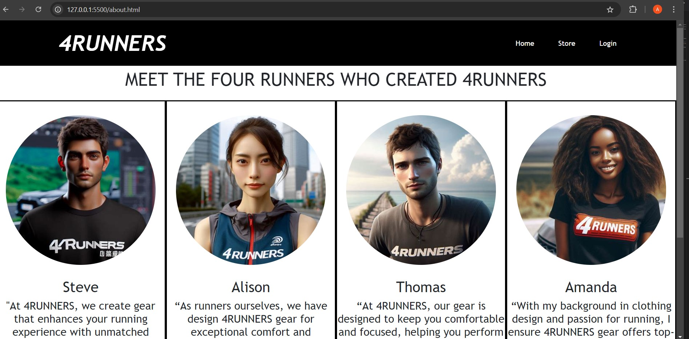
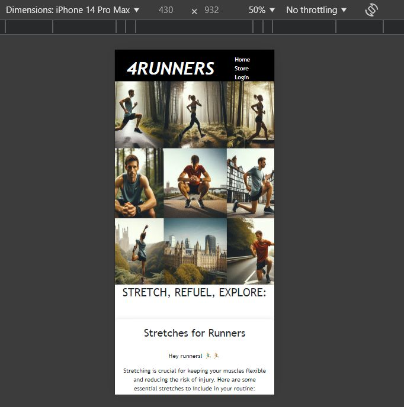
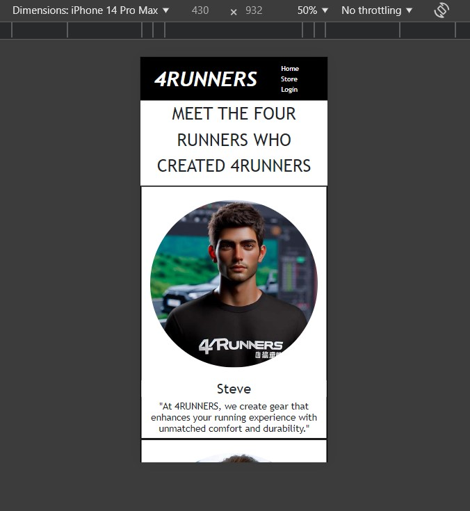
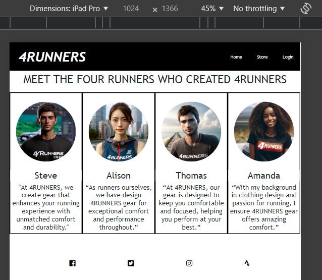

# L5Project1
<h1><u>4RUNNERS</u></h1>

Welcome to 4RUNNERS, your go-to online store for performance running clothing. This project includes a responsive website featuring product cards, a store page, and information about the four fictitious runners who founded 4RUNNERS.

The design I have chosen harnesses the passion and love I have for running. I have chosen to create a website to sell running clothing online.

I have decided on the name 4RUNNERS, as to my knowledge and through a Google search I can not find anyone using this name. 4RUNNERS is a play on the word 4=For to show that this website is designed ‘for runners.’

I wanted to keep the design colours simple and therefore have chosen for a black and white theme.

<h2><u>Table of Contents</u></h2>
    <li>Project Overview</li>
    <li>Features</li>
    <li>Responsive Design</li>
    <li>Lighthouse Performance</li>

<h2><u>Project Overview</u></h2>
4RUNNERS is designed to provide a seamless shopping experience for runners looking for high-quality, performance-oriented running gear. The website is fully responsive and has been tested on various devices to ensure optimal performance.

<h2><u>Features</u></h2>

<li>Home Page: Introduction to 4RUNNERS and promotional offers. </li>
<li>Store Page: Browse and purchase running gear.</li>
<li>About Us Page: Meet the four runners who founded 4RUNNERS.</li>
<li>Fitness Page: Tips and routines for runners.</li>
<li>Login Page: Secure login for users. </li>

<h2><u>Responsive Design</u></h2>
The website is designed to be fully responsive, ensuring a great user experience on mobile, tablet, and desktop devices.

<h3><u>Mobile Views</u></h3>

<li>Login Page: </li>
<li>Store Page: </li>
<li>Fitness Page: 
<li>About Page: </li>

<h3><u>Tablet Views</u></h3>

<li>Login Page: </li>
<li>Store Page: </li>
<li>Fitness Page: </l>
<li>About Page: </li>

<h2><u>Lighthouse Performance</u></h2>

The website has been tested using Lighthouse on 31/08/2024, to ensure high performance, accessibility, best practices, and SEO.

<h3><u>Desktop</u></h3>
<li>Performance: 99</li>
<li>Accessibility: 93</li>
<li>Best Practices: 96</li>
<li>SEO: 91</li>

<h3>Mobile</h3>
<li>Performance: 92</li>
<li>Accessibility: 93</li>
<li>Best Practices: 96</li>
<li>SEO: 91</li>

